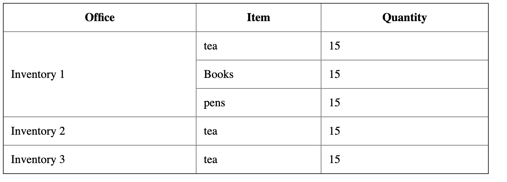

# Group Table Data by Rows
Group table rows according to a certain subcategory.

## Example



The table above is the presented of the data below.

### Data
```javascript
[
    {
        category: 'Inventory 1',
        items: [
            {
                name: 'tea',
                quantity: 15
            },
            {
                name: 'Books',
                quantity: 15
            },
            {
                name: 'pens',
                quantity: 15
            }
        ]
    },
    {
        category: 'Inventory 2',
        items: [
            {
                name: 'tea',
                quantity: 15
            }
        ]
    },
    {
        category: 'Inventory 3',
        items: [
            {
                name: 'tea',
                quantity: 15
            }
        ]
    }
]
```
To get the codes
 - Clone the repo. `https://github.com/NdauwaRafael/group-table-rows.git`
 - Open the code in editor
 - Modify the code 
 - Enjoy!
